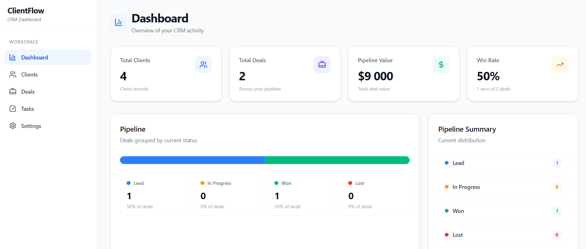
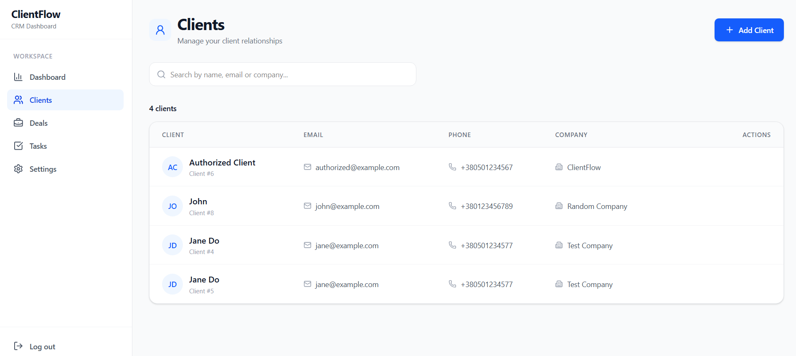
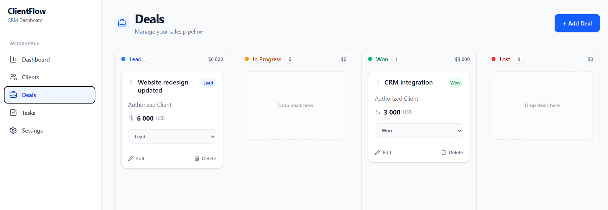
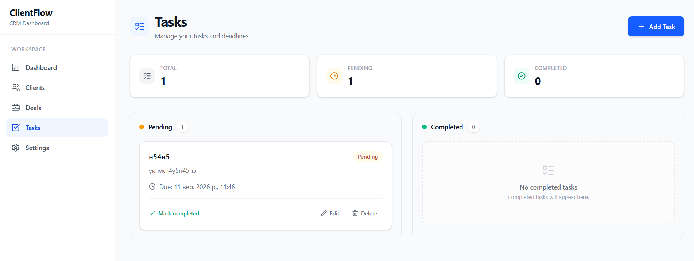

# ClientFlow

ClientFlow is a full-stack CRM SaaS application for managing clients, sales deals, tasks, and business activity from a single dashboard.

The project was built as a portfolio application with a modern frontend, REST API backend, PostgreSQL database, JWT authentication, Docker, and a responsive SaaS-style interface.

## Features

### Authentication

* User registration and login
* JWT authentication
* Protected application routes
* Automatic handling of invalid authentication
* Logout

### Clients

* Create, read, update, and delete clients
* Search clients by name, email, or company
* Client-specific data isolation
* Responsive data table
* Client initials avatars

### Deals

* Create, read, update, and delete deals
* Four deal stages:

  * Lead
  * In Progress
  * Won
  * Lost
* Kanban sales pipeline
* Drag and drop between stages
* Manual status updates
* Deal value tracking
* Client association

### Tasks

* Create, read, update, and delete tasks
* Pending and completed states
* Due dates
* Overdue task detection
* Task statistics

### Dashboard

* Total clients
* Total deals
* Total pipeline value
* Win rate
* Deal distribution by status
* Recent deals
* Pipeline overview

### Settings

* Account information
* Light and dark themes
* Session management
* Logout

## Screenshots

### Dashboard



### Clients



### Deals



### Tasks



## Tech Stack

### Frontend

* React
* TypeScript
* Vite
* Tailwind CSS
* React Router
* TanStack Query
* Axios
* Lucide React

### Backend

* Python
* FastAPI
* SQLAlchemy
* PostgreSQL
* Alembic
* Pydantic
* JWT
* Argon2 password hashing

### Infrastructure

* Docker
* Docker Compose
* Git
* GitHub

## Architecture

```text
┌─────────────────────────────┐
│     React + TypeScript      │
│      Tailwind + Vite        │
└──────────────┬──────────────┘
               │
               │ REST API
               ▼
┌─────────────────────────────┐
│          FastAPI            │
│       JWT Authentication    │
└──────────────┬──────────────┘
               │
               ▼
┌─────────────────────────────┐
│         SQLAlchemy          │
│         ORM Layer           │
└──────────────┬──────────────┘
               │
               ▼
┌─────────────────────────────┐
│        PostgreSQL           │
└─────────────────────────────┘
```

## Project Structure

```text
ClientFlow/
│
├── backend/
│   ├── alembic/
│   │   └── versions/
│   ├── app/
│   │   ├── api/
│   │   │   ├── auth.py
│   │   │   ├── clients.py
│   │   │   ├── deals.py
│   │   │   ├── dashboard.py
│   │   │   ├── tasks.py
│   │   │   └── dependencies.py
│   │   ├── core/
│   │   ├── db/
│   │   ├── models/
│   │   ├── schemas/
│   │   └── services/
│   ├── Dockerfile
│   └── requirements.txt
│
├── frontend/
│   ├── src/
│   │   ├── components/
│   │   ├── layouts/
│   │   ├── pages/
│   │   ├── services/
│   │   └── types/
│   ├── package.json
│   └── vite.config.ts
│
├── docker-compose.yml
├── alembic.ini
├── .gitignore
└── README.md
```

## Getting Started

### Requirements

* Docker Desktop
* Git
* Node.js

### 1. Clone the repository

```bash
git clone <repository-url>
cd ClientFlow
```

### 2. Configure environment variables

Create a `.env` file in the project root:

```env
JWT_SECRET=your-secret-key
JWT_ALGORITHM=HS256
ACCESS_TOKEN_EXPIRE_MINUTES=30
```

The `.env` file should never be committed to Git.

### 3. Start backend and PostgreSQL

```bash
docker compose up -d --build
```

### 4. Apply database migrations

```bash
docker compose exec backend alembic upgrade head
```

### 5. Start the frontend

Open another terminal:

```bash
cd frontend
npm install
npm run dev
```

### 6. Open the application

Frontend:

```text
http://localhost:5173
```

Backend:

```text
http://localhost:8000
```

Swagger API documentation:

```text
http://localhost:8000/docs
```

## API

The main API modules are:

```text
/auth
/clients
/deals
/tasks
/dashboard
```

FastAPI automatically provides interactive Swagger documentation at:

```text
http://localhost:8000/docs
```

## Authentication Flow

```text
User
 │
 ▼
Login / Register
 │
 ▼
FastAPI
 │
 ▼
JWT Access Token
 │
 ▼
Browser localStorage
 │
 ▼
Axios Authorization Header
 │
 ▼
Protected API endpoints
```

Invalid or expired authentication results in a `401` response, after which the frontend removes the stored token and redirects the user to the login page.

## Database

The application uses PostgreSQL with SQLAlchemy as the ORM.

Alembic is used for database migrations.

Current main entities:

```text
User
 ├── Clients
 ├── Deals
 └── Tasks

Client
 └── Deals
```

## Production Build

Create a production frontend build with:

```bash
cd frontend
npm run build
```

The generated files will be placed in:

```text
frontend/dist
```

## Current Project Status

ClientFlow currently provides the core functionality of a CRM SaaS:

* Authentication
* Client management
* Sales pipeline
* Kanban board
* Drag and drop deal management
* Task management
* Dashboard analytics
* Account settings
* Dark mode
* Responsive interface
* Dockerized backend and database

## Future Improvements

Possible future enhancements include:

* Automated testing
* CI/CD
* Production deployment
* Role-based access control
* Advanced analytics
* Notifications
* Email integration
* File attachments
* Pagination and advanced filtering
* Activity history

## Author

Developed as a full-stack portfolio project using Python, FastAPI, React, TypeScript, PostgreSQL, and Docker.
